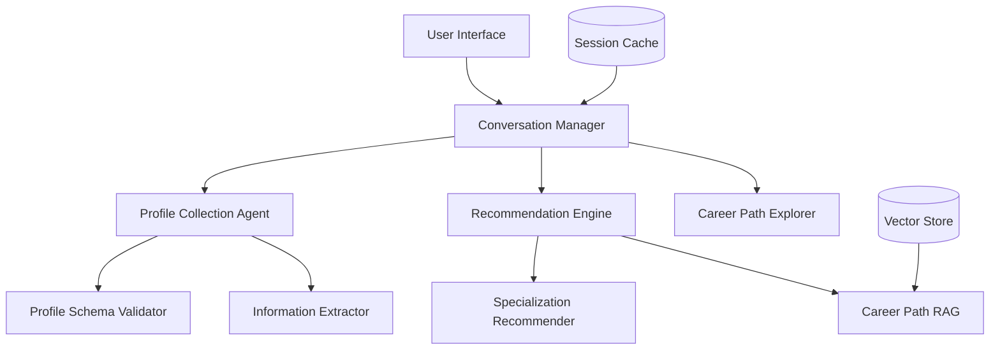

# University Specialization Recommender Agent

An AI-powered conversational agent that helps students choose university specializations based on their academic profile, interests, and career goals.

## Features

- 🎯 Interactive profile collection through natural conversation
- 🧠 Intelligent validation of profile completeness
- 🎓 Personalized university specialization recommendations
- 💼 Career path suggestions aligned with recommendations
- ⚡ Fast response times (< 1 second)
- 🔄 Caching for improved performance
- 🛡️ Rate limiting for API protection

## Architecture



## Setup

1. Clone the repository:
```bash
git clone https://github.com/yourusername/university-specialization-recommender.git
cd university-specialization-recommender
```

2. Create a virtual environment:
```bash
python -m venv venv
source venv/bin/activate  # On Windows: venv\Scripts\activate
```

3. Install dependencies:
```bash
pip install -r requirements.txt
```

4. Create a `.env` file with your configuration:
```env
OPENAI_API_KEY=your_api_key_here
DEBUG=True
REDIS_URL=redis://localhost:6379  # Optional
```

5. Run the application:
```bash
python app.py
```

The server will start at `http://localhost:8000`

## API Documentation

### WebSocket Endpoint

Connect to the WebSocket endpoint to start a conversation:

```javascript
const ws = new WebSocket('ws://localhost:8000/ws/{session_id}');

ws.onmessage = function(event) {
    const response = JSON.parse(event.data);
    console.log(response.content);
};

// Send message
ws.send('Hello, I need help choosing a university specialization.');
```

## Project Structure

```
university_recommender/
├── app.py                  # Main application entry point
├── config.py              # Configuration settings
├── requirements.txt       # Dependencies
├── README.md             # Project documentation
├── src/
│   ├── managers/
│   │   └── conversation_manager.py  # Conversation flow management
│   ├── models/
│   │   └── student_profile.py      # Profile schema definition
│   └── utils/
│       ├── cache.py               # Caching utility
│       └── rate_limiter.py        # Rate limiting utility
└── tests/                # Test files
```

## Contributing

1. Fork the repository
2. Create your feature branch (`git checkout -b feature/amazing-feature`)
3. Commit your changes (`git commit -m 'Add amazing feature'`)
4. Push to the branch (`git push origin feature/amazing-feature`)
5. Open a Pull Request

## License

This project is licensed under the MIT License - see the LICENSE file for details. 